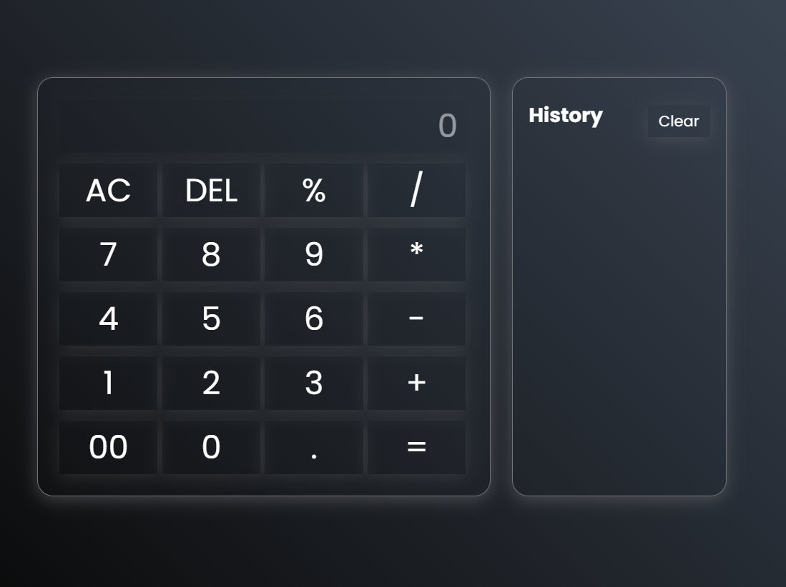

# Modern Calculator with History

A sleek and modern calculator built with HTML, CSS, and JavaScript that includes calculation history functionality.



## Features

- Clean and modern user interface
- Basic arithmetic operations (+, -, *, /)
- Percentage calculations
- Clear (AC) and Delete (DEL) functions
- Calculation history panel with local storage
- Responsive design with glass morphism effect
- Error handling for invalid calculations

## Technologies Used

- HTML5
- CSS3 (with Flexbox)
- Vanilla JavaScript
- Local Storage API
- Google Fonts (Poppins)

## Live Demo

[View Live Demo](https://fizur-rahman-fahim.github.io/calculator-project/)

## Installation

1. Clone the repository:
```bash
git clone https://github.com/Fizur-Rahman-Fahim/calculator-project.git
```

2. Navigate to the project directory:
```bash
cd calculator-project
```

3. Open `index.html` in your web browser

## Usage

- Use number buttons (0-9) to input values
- Click operators (+, -, *, /, %) for calculations
- Press '=' to see the result
- 'AC' clears all input
- 'DEL' removes the last character
- View calculation history in the right panel
- 'Clear' button removes all history

## Contributing

1. Fork the project
2. Create your feature branch (`git checkout -b feature/NewFeature`)
3. Commit your changes (`git commit -m 'Add some NewFeature'`)
4. Push to the branch (`git push origin feature/NewFeature`)
5. Open a Pull Request

## License

This project is licensed under the MIT License - see the [LICENSE](LICENSE) file for details.

## Contact

Fizur Rahman Fahim - [GitHub Profile](https://github.com/Fizur-Rahman-Fahim)

Project Link: [https://github.com/Fizur-Rahman-Fahim/calculator-project](https://github.com/Fizur-Rahman-Fahim/calculator-project)

---
© 2025 Fizur Rahman Fahim. All Rights Reserved.
